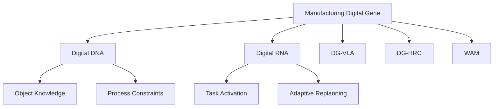

# Step 5: 生成每日 / 每周研究思考文档

## 目标

基于已分析论文，生成能够持续沉淀用户研究主线的思考文档。重点不是总结今天读了什么，而是更新以下内容：

- 制造数字基因理论体系
- DG-VLA 框架
- WAM / world model 结合路径
- HRC 中的记忆对齐、任务重规划和主动适应
- 可执行实验与论文选题

## 核心要求

每篇思考文档必须回答：

1. 今天的论文共同揭示了什么研究趋势？
2. 它们如何改变或强化用户对制造数字基因的理解？
3. Digital DNA / Digital RNA 的边界是否需要更新？
4. 数字基因应该以什么方式进入 VLA / WAM / HRC？
5. 是否出现了新的可执行实验？
6. 是否形成了新的论文贡献点？

## 输出路径

```text
output/daily/YYYY-MM-DD_daily_thinking.md
output/weekly/YYYY-MM-DD_weekly_summary.md
```

## 必需章节

```markdown
# Research Thinking: YYYY-MM-DD

## 1. Today's Core Theme

用 3-5 句话概括今天的核心主题。

示例：

- Digital Gene as structured context for VLA
- World model as dynamic RNA activation mechanism
- Geometry primitive as bridge between unseen objects and robot action
- HRC requires memory alignment rather than only intention prediction

## 2. Key Findings

列出 3-5 条关键发现。每条发现必须包含：

- What the paper says
- Why it matters
- How it relates to user's research

## 3. Relation to Manufacturing Digital Gene

| Dimension | Today's Insight | Evidence / Source Paper | Implication |
|---|---|---|---|
| Digital DNA | | | |
| Digital RNA | | | |
| Gene-as-Context | | | |
| Gene-as-Constraint | | | |
| Gene-as-Memory | | | |
| Gene-as-Policy Interface | | | |

## 4. Updated DG-VLA Understanding

回答：

- 哪些 VLA 组件可以被数字基因增强？
- 数字基因应该作为 prompt、retrieval context、constraint layer、memory module、world prior 还是 action interface？
- 哪种方式最适合当前阶段实验？
- 现有 VLA 的哪些能力可以先复用，不需要从头训练？

## 5. Updated WAM / World Model Understanding

回答：

- 今天的论文是否支持“世界如何因动作而变化”的建模？
- 数字基因能否作为 world model 的状态先验、对象约束或动作语义？
- 是否支持“第三视角连续动态学习 + 第一视角稀疏关键帧对齐”的训练范式？
- 如果结合 WAM，数字基因更像 DNA、RNA、还是 policy interface？

## 6. Updated HRC Understanding

回答：

- 今天的论文对人机协作有什么启发？
- 是否支持用户提出的 memory mismatch / situational resonance 思路？
- 是否能降低显式人类命令比例？
- 是否能支持人类意外干预后的主动任务重规划？

## 7. Research Hypothesis Update

更新当前研究假设。

格式：

> Previous hypothesis:
>
> Updated hypothesis:
>
> Reason for update:

## 8. Possible Experiments

生成 2-3 个实验想法。

每个实验包含：

- Experiment name:
- Research question:
- Task scenario:
- Method:
- Baselines:
- Metrics:
- Expected result:
- Required resources:

## 9. Possible Paper Ideas

生成 2-3 个论文选题。

每个选题包含：

- Title:
- Core problem:
- Method:
- Experiment:
- Expected contribution:
- Risk:

## 10. Framework Update

说明今天是否需要更新用户的框架图或术语体系。

必须包含：

- New module to add:
- Module to rename:
- Connection to add:
- Concept to clarify:

## 11. Knowledge Gaps

列出仍然缺失的知识：

- Need more papers on:
- Need experiments on:
- Need datasets / benchmarks on:
- Need implementation tools on:

## 12. Tomorrow / Next Search Direction

给出下一轮搜索关键词和方向。
```

## Mermaid 图要求

如果生成较长的 weekly summary，必须包含至少一个 Mermaid 图：



日常短文档可以不强制 Mermaid，但如果涉及框架演进，优先使用 Mermaid。

## 长期记忆更新

生成思考文档后，如果出现新的稳定观点，应同步更新：

```text
data/research_memory.md
```

更新内容包括：

- 新的核心假设
- 新的术语定义
- 新的实验想法
- 用户明确偏好的研究方向
- 被否定或暂缓的方向

## 质量检查

一篇有效的思考文档必须包含：

- 至少 3 条关键发现
- 至少 1 条研究假设更新
- 至少 1 个实验想法
- 至少 1 个论文选题
- 至少 1 条下一轮搜索方向
- 明确说明对 Digital Gene / DG-VLA / WAM / HRC 的影响
